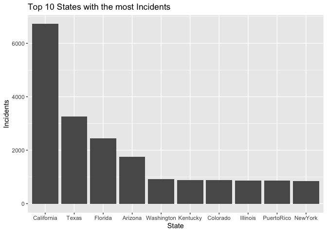
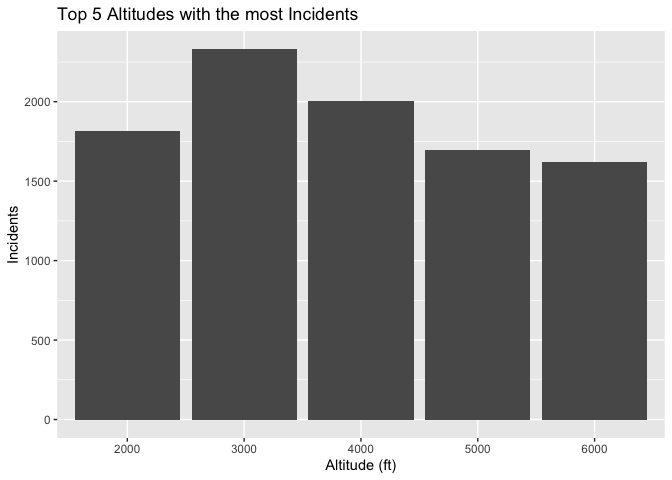

<!-- README.md is generated from README.Rmd. Please edit that file -->

# LaserIncidents

<!-- badges: start -->

<!-- badges: end -->

The goal of LaserIncidents is to identify the frequency of incidents in
different areas across the U.S. as well as the number of injuries caused
by laser incidents reported over the years.

## Installation

You can install the released version of LaserIncidents from
[CRAN](https://CRAN.R-project.org) with:

``` r
install.packages("LaserIncidents")
```

And the development version from [GitHub](https://github.com/) with:

``` r
# install.packages("devtools")
devtools::install_github("aarifovic21/LaserIncidents")
```

## Example

This is a basic example which shows you how to solve a common problem:

``` r
library(LaserIncidents)
data("LaserIncidents")
injury_yes <- LaserIncidents %>%
  filter(injury %in% c("YES", "Yes"))
```

What is special about using `README.Rmd` instead of just `README.md`?
You can include R chunks like so:

### a. Are injuries from laser pointers common? Show how many injuries there are per year.

SOLUTION:

``` r
#Filtering date for just Year & sum of Injuries
laser_injury <- LaserIncidents %>%
  mutate(incident_date = gsub("-[0-9][0-9]-[0-9][0-9]","", incident_date)) %>%
  group_by(incident_date) %>%
  filter(injury %in% c("YES", "Yes")) %>%
  summarise(injury = n())
#Percent of incidents with injury
sum(laser_injury$injury)/nrow(LaserIncidents)
#> [1] 0.005315954
#Table of total injuries per year
kable(laser_injury)
```

<table>

<thead>

<tr>

<th style="text-align:left;">

incident\_date

</th>

<th style="text-align:right;">

injury

</th>

</tr>

</thead>

<tbody>

<tr>

<td style="text-align:left;">

2015

</td>

<td style="text-align:right;">

54

</td>

</tr>

<tr>

<td style="text-align:left;">

2016

</td>

<td style="text-align:right;">

26

</td>

</tr>

<tr>

<td style="text-align:left;">

2017

</td>

<td style="text-align:right;">

28

</td>

</tr>

<tr>

<td style="text-align:left;">

2018

</td>

<td style="text-align:right;">

25

</td>

</tr>

<tr>

<td style="text-align:left;">

2019

</td>

<td style="text-align:right;">

44

</td>

</tr>

</tbody>

</table>

Given that the entire data set includes over 33k observations, a total
of 177 injuries, 0.5% of the entire data, does not appear to be a lot.
2015 had the most injuries with 54, followed by 2019 with 44.

### b) What were the top 10 states with the most incidents over the past four years? Provide a grapical image below.

SOLUTION:

``` r
#Cleaning State variable to remove duplicate state names
frequent_laser <- LaserIncidents %>%
  mutate(
    incident_date = gsub("-[0-9][0-9]-[0-9][0-9]","", incident_date),
    state = gsub("\\s+", "", state, perl = TRUE)) %>%
  group_by(state) %>%
  summarise(incidents = n()) %>%
  arrange(desc(incidents)) %>%
  head(10)

#Graph of top 10 states
ggplot(data = frequent_laser, aes(x = reorder(state, -incidents), y = incidents)) + 
  geom_bar(stat = "identity") + 
  labs(title = "Top 10 States with the most Incidents", x = "State", y = "Incidents")
```


Based on the graph above, California had the highest number of laser
pointer incidents, followed by Texas, Florida, Arizona, Washington,
Kentucky, Colorado, Illinois, Puerto Rico, and New York.

### c) What were the top 5 altitudes at which laser incidents were most frequent? Provide a grapical image below.

``` r
#remove unknowns & N/A from altitude
altitude_laser <- LaserIncidents %>%
  filter(!grepl("[A-z]", altitude)) %>%
  group_by(altitude) %>%
  summarise(n = n()) %>%
  arrange(desc(n)) %>%
  head(5)
#> `summarise()` ungrouping output (override with `.groups` argument)

#Graph of top 5 altitudes
ggplot(data = altitude_laser, aes(x = (altitude), y = n)) + 
  geom_bar(stat = "identity") + 
  labs(title = "Top 5 Altitudes with the most Incidents", x = "Altitude (ft)", y = "Incidents")
```


Based on the figure above, the top 5 altitudes where laser pointer
incidents occurred were as followed in descending order: 3000ft, 4000ft,
2000ft, 5000ft, and 6000ft.

### Insights

Based on the information above, it can be summarized that overall, laser
pointers pointed at airplanes fortunately do not cause many injuries. Of
the 33,296 observations collected from the years 2015 to 2019, there was
only a total of 177 injuries. This does not imply that pointing lasers
at airplanes is okay to do, it is still highly illegal as it can impair
the pilots flying abilities and does have the risk of injury. Over this
time period, California had by the most incidents occurred (6,724),
which is over double the next most frequent state, Texas, which had 3255
incidents. Both Florida and Arizona also had well over 1,000 incidents,
totaling at 2,436 and 1,750 each. Furthermore, based on the data
collected, laser pointer incidents were most commonly detected at an
altitude of 3,000 feet (2,329 times).

In that case, don’t forget to commit and push the resulting figure
files, so they display on GitHub\!
